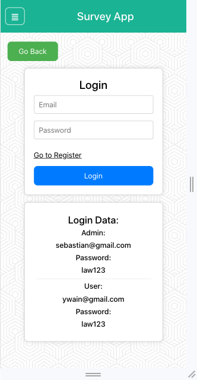
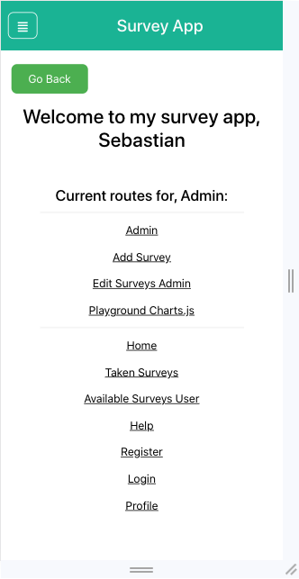
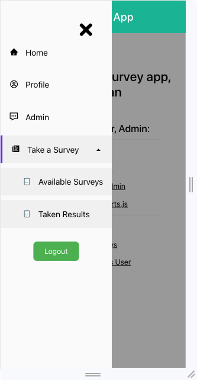
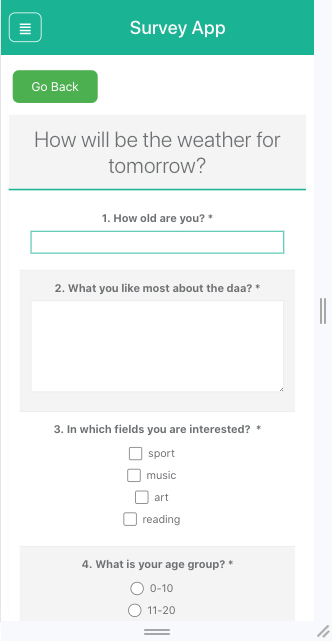

Certainly! Here's an improved version of your `README.md` file for the Survey App with React and Firebase. I've added some headings, improved formatting, and clarified the content for better readability:

```markdown
# Survey App with React and Firebase

Survey App is a simple survey application built using React for the front-end and Firebase for the back-end. It enables users to participate in surveys created by the admin and view the results of completed surveys. This application empowers you to create custom surveys, collect responses, and analyze the results effectively.

## Preview

<div align="center">
  
  
</div>

## Features

- **Authentication:** Users can sign up and log in to participate in surveys.
- **Survey Creation:** Admins can create custom surveys with multiple-choice questions.
- **Survey Participation:** Users can participate in surveys by selecting their answers.
- **Survey Results:** Both Admins and Users can view the survey results.
- **Chart.js Integration:** Graphical representation of survey results using Chart.js (dummy data at the moment).

## Technologies Used

- **React:** A JavaScript library for building interactive user interfaces.
- **React Redux:** A predictable state container for managing application state.
- **Firebase:** A cloud-based platform for developing mobile and web applications.
  - **Firebase Authentication:** Handles user authentication securely.
  - **Cloud Firestore:** A scalable NoSQL database to store and sync data in real-time.
- **SurveyJS:** A JavaScript library for creating customizable and interactive surveys.
- **React Beautiful DND:** A library for implementing smooth drag-and-drop interfaces in React applications.
- **CSS Modules:** Local scope CSS styling for modular and maintainable designs.
- **ESLint:** A tool for identifying and fixing problems in JavaScript code, ensuring code quality and consistency.

## Good to Know

### Styling

In this project, styles are imported as modules, and specific class names (e.g., `styles.formContainer`) are used for each element. This approach ensures styles are scoped to specific components, avoiding conflicts with other parts of the application. Check out `Contact.js` and `Contact.css` for examples.

### ESLint Setup

1. To view errors in the browser, run: `npx eslint .` (displays issues in the console).
2. To automatically fix issues, run: `npx eslint . --fix` (applies fixes where possible).
3. Start working on your files after addressing linting problems.

## Getting Started

1. In your project directory, create a new file named `.env`.
2. Inside the `.env` file, define your Firebase configuration variables without quotes or special characters. For example:

   ```
   REACT_APP_FIREBASE_API_KEY=your-api-key
   REACT_APP_FIREBASE_AUTH_DOMAIN=your-auth-domain
   REACT_APP_FIREBASE_PROJECT_ID=your-project-id
   REACT_APP_FIREBASE_STORAGE_BUCKET=your-storage-bucket
   REACT_APP_FIREBASE_MESSAGING_SENDER_ID=your-messaging-sender-id
   REACT_APP_FIREBASE_APP_ID=your-app-id
   ```

3. Update your Firebase configuration file to read the environment variables from `.env`:

   ```javascript
   const firebaseConfig = {
     apiKey: process.env.REACT_APP_FIREBASE_API_KEY,
     authDomain: process.env.REACT_APP_FIREBASE_AUTH_DOMAIN,
     projectId: process.env.REACT_APP_FIREBASE_PROJECT_ID,
     storageBucket: process.env.REACT_APP_FIREBASE_STORAGE_BUCKET,
     messagingSenderId: process.env.REACT_APP_FIREBASE_MESSAGING_SENDER_ID,
     appId: process.env.REACT_APP_FIREBASE_APP_ID,
   };
   ```

4. Install project dependencies:

   ```bash
   npm install
   ```

5. To run the project locally, use the following command:

   ```bash
   npm start
   ```

## Preview

<div align="center">
  
  
</div>

Happy surveying! 📝✨
```

